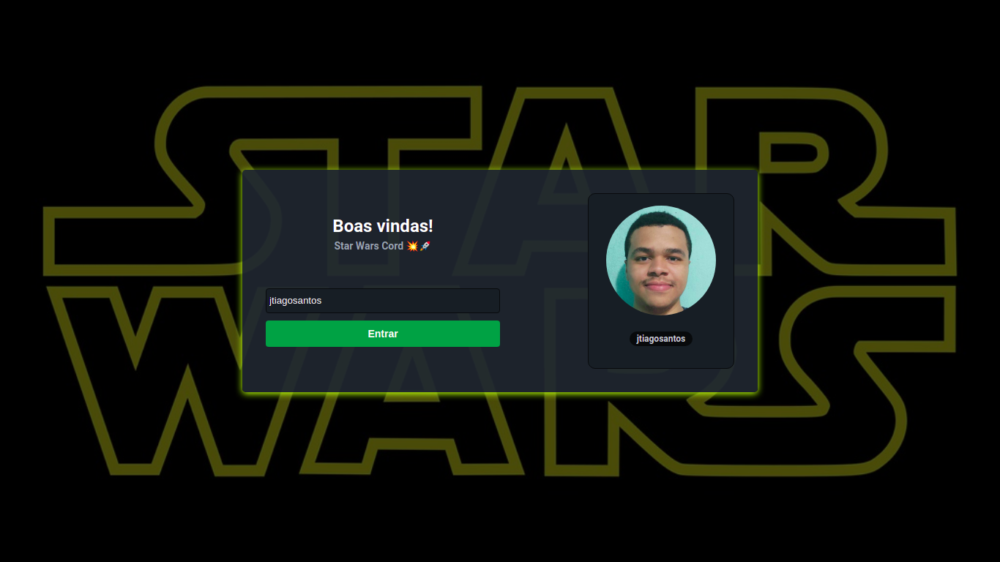
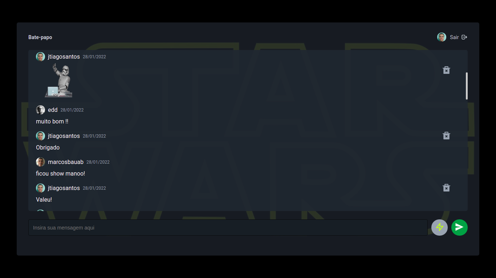

<h1 align="center">Star Wars Cord</h1>

<p align="center">
  
  
  <a href="https://github.com/jtiagosantos/star-wars-cord/commits/master">
    
  </a>
  
   <a href="https://github.com/jtiagosantos/star-wars-cord/stargazers">
    
  </a>
</p>

<h4 align="center">
	🚧  Star Wars Cord 💥 Completed 🚀 🚧
</h4>

<p align="center">
  <a href="#-features">Features</a> •
  <a href="#-run-project">Run Project</a> •
  <a href="#-technologies">Technologies</a> •
  <a href="#-deploy">Deploy</a> •
  <a href="#-author">Author</a> •
  <a href="#-license">License</a> •
</p>

<br>

<h1 align="center">
    
</h1>

<h1 align="center">
    
</h1>

<hr />

## ⚙️ Features

- [x] Authentication with Github username
- [x] Send messages tex
- [x] Send messages gif
- [x] Receive messages
- [x] Delete the message itself 

<hr>

## 🚀 Run Project

1️⃣ Clone project and access its folder:

```bash
$ git clone https://github.com/jtiagosantos/star-wars-cord.git
$ cd star-wars-cord
```

2️⃣ Install dependencies:

```bash
$ yarn ou npm i
```

3️⃣ Add environment variables:

```bash
#Supabase
NEXT_PUBLIC_SUPABASE_URL=xxxxxxxxxxxxxxxxxxxxxxxxxx
NEXT_PUBLIC_SUPABASE_ANON_KEY=xxxxxxxxxxxxxxxxxxxxxxxxxx
```

4️⃣ Start project:

```bash
$ yarn dev ou npm run dev
```
<hr>

## 🛠 Technologies

The following tools were used in the construction of project:

- **[Next.js](https://nextjs.org/)**
- **[Typescript](https://www.typescriptlang.org/)**
- **[Supabase](https://supabase.com/)**
- **[React Query](https://react-query.tanstack.com/)**
- **[Styled Components](https://styled-components.com/)**

<hr>

## :cloud: Deploy

- **[Star Wars Cord](https://star-wars-cord-git-main-jtiagosantos.vercel.app/)**

<hr>

## 👨‍💻 Author


<strong><a href="https://github.com/jtiagosantos">Tiago Santos </a>🚀</strong>

[](https://www.linkedin.com/in/josetiagosantosdelima/)
[](mailto:tiago.santos@icomp.ufam.edu.br)

<hr>

## 📝 License

This project is under license [MIT](./LICENSE).
